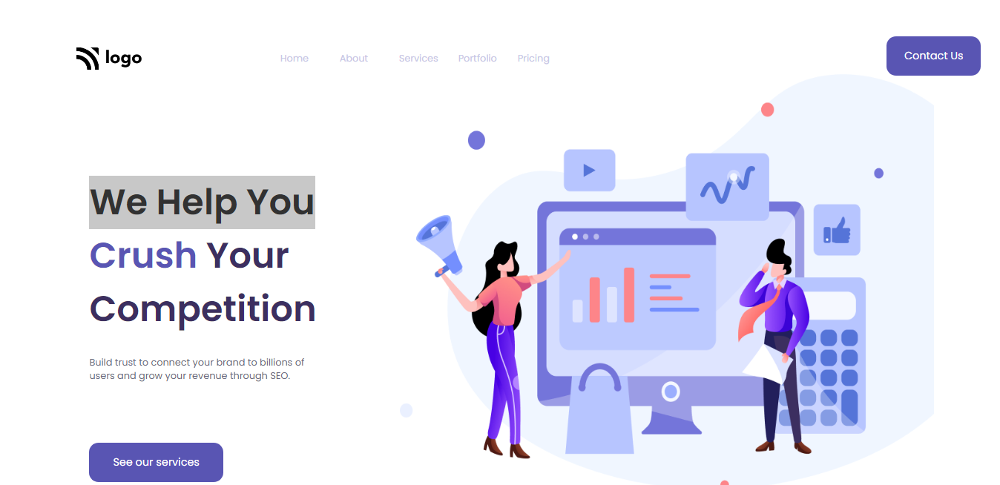

# Project - 04

### We Help You (Landing Page)

---

## About project
---

Only HTML and CSS Were Used To Create This Project. A variety of HTML and CSS properties are used to create this lovely landing page.
This page includes separate content and image sections. Content Part Has A Good White Background Color That Goes Well With An Image.

---

## Learning Experience
---
This project taught me how to use SVG files and make them look relevant to the content. While making this page, I gained more knowledge about CSS.

## How Much Time I Took To Finish This Project...? 
>Overall, it took me four hours to do this project. Yes, there was much trial and error as well as learning and exploration.

---

##  Special Thanks To : [Hitesh Choudhary Sir](https://www.instagram.com/hiteshchoudharyofficial/?hl=en)  And [Ineuron](https://ineuron.ai/course/Full-Stack-Javascript-Web-Developer)

>Thank You Very Much For This Amazing Course.

---

## Screenshot 

[Live Link](https://dancing-nougat-0cde59.netlify.app/)

---

>## Who Am I ?

>My Name Is Karan I am A Learner Who is Interested in Sharing Knowledge About The Skills That I'm Developing to Become A Full-Stack Web Developer.

>## Check Out My Work on 

>[Netlify](https://app.netlify.com/teams/karan9846/overview?_ga=2.175703073.206776847.1659963657-634189433.1659791041)

>[FindCoder](https://www.findcoder.io/u/karan18)

>[hashnode](https://hashnode.com/@karan787)

>Let's get Connected [@karanjaria](https://www.instagram.com/karanjaria/?hl=en)